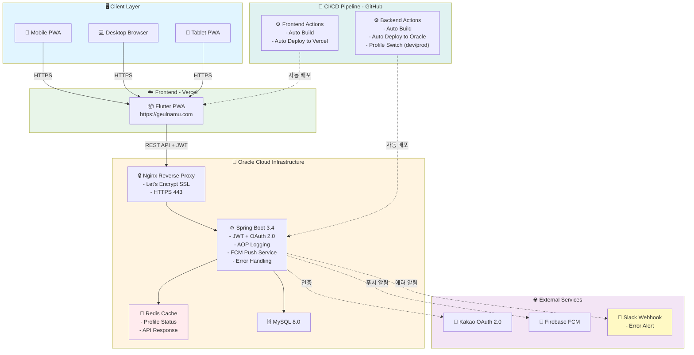

# 프로젝트 포트폴리오

# 프로젝트 개요

- 기간: 2025.6 ~ 2025.12 (실 개발기간 약 5개월)
- 동기: 운영진으로 활동 중인 독서토론 모임에서 평소 모임원들에게 들었던 불편 사항들과 운영 및 관리의 효율화 및 자동화의 필요성을 느껴 직접 웹 앱을 만들게 됨
- 현재 상태: 개발 마무리 작업 진행중(테스트 및 기기별 대응 확인중)

# 링크

- 서비스 URL: https://geulnamu.com
- API URL: https://api.geulnamu.com
- GitHub: https://github.com/jujang/Geulnamu
- API 문서: https://api.geulnamu.com/docs/index.html

# 주요 성과

### 핵심 기능

- **QR 출석**: QR 코드 기반 간편 출석 체크
- **토론 그룹**: 조건별 토론 그룹 편성
- **실시간 알림**: Firebase FCM 푸시 알림

### 성능 최적화

- **Redis 캐싱**: API 응답속도 **50% 개선** (100ms → 50ms)

### 보안

- **인증/인가**: Kakao OAuth 2.0 + JWT 토큰 기반 인증, 6단계 RBAC

### 운영 효율화

- **실시간 모니터링**: Slack 웹훅으로 500 에러 즉시 알림
- **자동 배포**: GitHub Actions로 **3분 내 배포**
- **월 운영 비용**: **0$** (Oracle Cloud, Vercel, Slack Free)

### 개발 생산성

- **CI/CD 자동화**: 배포 작업 자동화로 개발 집중력 향상

# 기술 스택

### Backend

- Spring Boot 3.4 / JAVA 17 / Spring Data JPA / QueryDSL / MySQL / OAuth 2.0 / JWT / FCM

### Frontend

- Flutter PWA (반응형) / GoRouter / AI-assisted(Claude)

### Infrastructure

- Oracle Cloud(Ubuntu) / Vercel / Nginx / Let’s Encrypt / Github Actions

# 시스템 아키텍쳐

# 주요 기능

- 카카오 로그인: 소셜 로그인 기반 회원 인증 (JWT + OAuth 2.0 + 6단계 역할 RBAC)
- 모임 관리: 정기/번개/특수 모임 생성, 일정·장소 설정, 시간 기반 수정 제한
- QR 코드 출석: 모임별 고유 QR 생성/스캔, 실시간 출석 처리, 현황 페이지에서 모임원별 출석 현황 확인
- 토론 그룹 관리: 토론 참여 의사 선택, 참여 희망자 대상으로 조 편성, 토론 그룹 드래그 앤 드롭 관리
- 발제문 시스템: 그룹별 토론 주제 작성/조회, 시간 기반 수정 제한
- 회원 관리: 6단계 역할 기반 권한(MEMBER~ADMIN), 회원 활성화/비활성화
- 모임원의 소리: 에러 보고/기능 요청 작성, 이슈 상태 관리 (관리자)
- 푸시 알림: FCM 기반 타겟팅 알림, 모임 공지, 개인별 수신 설정

# 화면 구성

### 인증 및 계정

- 로그인
- 홈 화면
- 프로필 관리

### 모임 관리

- 모임 목록
- 모임 목록 (필터 화면)
- 모임 생성/수정 (운영진용)
- 모임 상세 (운영진용)

### 출석 관리

- QR 출석
- 출석 현황

### 토론 및 발제

- 토론 그룹 편성
- 발제문 작성

### 회원 관리 (관리자)

- 회원 목록
- 권한 관리

### 운영 및 모니터링 (관리자)

- 모임원의 소리
- 푸시 알림 설정

### UI/UX

- 다크모드
- 반응형 (데스크톱 뷰)

# 기술적 챌린지

### AOP 기반 액션 로깅 시스템

- 문제
  - 장애 분석을 위한 로그 필요
- 해결법
  - Spring AOP + 커스텀 어노테이션(`@LogAction`, `@ErrorLogAction`) 활용
  - 비동기 처리(`@Async`)로 메인 로직 성능 영향 최소화
  - GET 요청은 에러만, POST/PATCH/DELETE는 전체 액션 로깅하여 DB 부하 균형
- 결과
  - 비동기 처리로 메인 로직 성능 영향 최소화
  - 로그 서버 비용 0$ (자체 DB 저장)

### Redis 캐싱을 통한 성능 최적화

- 문제
  - 모임 목록/상세 조회 API가 전체 요청의 많은 비중을 차지
  - 변경 빈도가 낮은 데이터를 반복 조회하여 DB 부하 발생
- 해결법
  - Spring Cache + Redis 연동하여 자주 조회되는 API에 캐싱 적용
  - TTL 5분 설정으로 데이터 신선도와 캐시 효율 균형 유지
- 결과
  - API 응답 속도 50% 개선 (100ms → 50ms)
  - 서버 부하 감소로 안정적인 서비스 제공

### GitHub Actions CI/CD 자동 배포 파이프라인

- 문제
  - 수동 배포 시, 빌드, 업로드, 재시작 등 반복 작업으로 시간 소요 및 실수 가능성 존재
  - 배포 작업 중 다른 개발 작업에 집중 불가
- 해결법
  - GitHub Actions로 main 브랜치 push시 자동 빌드 및 배포
  - Frontend: Flutter 빌드 → Vervel 배포 (2분)
  - Backend: Gradle 빌드 → Oracle Cloud 배포 (3분)
- 결과
  - 배포 완전 자동화로 개발 집중력 향상
  - 휴먼 에러 제거 및 배포 안정성 향상

# 개발 방식 및 특이사항

### AI 협업 기반 풀스택 개발

- **백엔드**: Spring Boot 3.4 기반 직접 설계 및 구현
  - CQRS 패턴, QueryDSL, Redis 캐싱 등 기술 활용
- **프론트엔드**: Claude AI와 협업하여 Flutter 구현
  - 디자인 시스템 가이드라인 작성 → AI 활용 개발
  - 일관된 UI/UX 유지 및 빠른 프로토타이핑
  - PWA 네비게이션 패턴 등 복잡한 문제 해결
- **배운 점**
  - 명확한 가이드라인 작성의 중요성
  - AI를 도구로 활용한 개발 생산성 향상

# 프로젝트 구조 (간단 버전)

### 백엔드(Spring boot) (기본 구조)

geulnamu_backend/
├── controller/ # REST API 엔드포인트
│ ├── login/ # 카카오 OAuth 로그인
│ ├── member/ # 회원 관리
│ ├── meeting/ # 모임 관리
│ ├── attendance/ # 출석 관리
│ ├── bookQuestion/ # 발제문 관리
│ ├── voc/ # 모임원의 소리
│ ├── fcm/ # 푸시 알림
│ └── actionHistory/ # 액션 로그
├── service/ # 비즈니스 로직
├── repository/ # 데이터 접근 (CQRS 패턴)
│ └── {domain}/
│ ├── CommandRepository # CUD 작업
│ ├── QueryRepository # 조회 작업
│ └── QueryRepositoryImpl # QueryDSL 구현
├── domain/ # 엔티티 + 도메인 로직
│ └── {domain}/
│ ├── Entity.java # JPA 엔티티
│ └── Enum.java # 도메인 Enum
└── infrastructure/ # 횡단 관심사
├── annotation/ # @LogAction, @AccessLevel
├── aspect/ # AOP (로깅)
├── config/ # Security, Firebase, Async
├── jwt/ # JWT 인증/인가
├── exception/ # 통합 예외 처리
└── response/ # 통일된 응답 구조

### 프론트엔드(Flutter PWA) (기본 구조)

geulnamu_frontend/lib/
├── core/ # 핵심 시스템
│ ├── config/ # 환경 설정 (API, 카카오)
│ ├── theme/ # 색상, 테마 (라이트/다크)
│ ├── utils/ # 유틸리티 (API, 날짜, PWA)
│ └── services/ # 코어 서비스 (인증, 설정)
├── services/ # 비즈니스 로직 (Singleton)
│ ├── home/ # 홈 서비스
│ ├── meeting/ # 모임 서비스
│ ├── attendance/ # 출석 서비스
│ ├── discussion/ # 토론 서비스
│ └── notification/ # FCM 알림
├── providers/ # 전역 상태 관리
│ ├── auth_provider # 인증 상태
│ └── theme_provider # 테마 상태
├── screens/ # 화면별 구조
│ └── {screen}/
│ ├── {screen}\_screen.dart
│ ├── mixins/ # 로직 Mixin
│ └── widgets/ # UI 위젯 (Static)
├── widgets/ # 공통 위젯
│ └── common/ # MainLayout, AppHeader
├── models/ # 데이터 모델
└── routes/ # GoRouter 네비게이션

### 아키텍쳐 특징

- **Backend**: 계층형 아키텍처 + CQRS + DDD 스타일
- **Frontend**: 하이브리드 (Service Singleton + Mixin + Static Widgets)

- 프로젝트 구조 (상세버전) [PROJECT_STRUCTURE.md](./PROJECT_STRUCTURE.md)

# CI/CD 파이프라인

- **GitHub Actions + Oracle Cloud/Vercel**
- 메인 브랜치 push 시 자동 빌드 및 배포
- 빌드 시간: 약 3분 (Backend) / 약 2분 (Frontend)
- 배포 URL
  - Frontend: https://geulnamu.com
  - Backend: https://api.geulnamu.com

# 주요 테이블 관계도(ERD)

링크: https://www.erdcloud.com/d/mgGNCamYYs28DYphr

# 향후 계획

- 기능 관련: 향후, 위치 기반 출석 체크 기능 추가 예정
- 서비스 관련: 기기별 대응 작업 완료 후, 모임과 논의를 거쳐 서비스 예정
