# 프로젝트 포트폴리오

## 프로젝트 개요

- 기간: 2025.6 ~ 2025.12 (실 개발기간 약 5개월)
- 동기: 운영진으로 활동 중인 독서토론 모임에서 평소 모임원들에게 들었던 불편 사항들과 운영 및 관리의 효율화 및 자동화의 필요성을 느껴 직접 웹 앱을 만들게 됨
- 현재 상태: 개발 마무리 작업 진행중(테스트 및 기기별 대응 확인중)

## 링크

- 서비스 URL: https://geulnamu.com
- API URL: https://api.geulnamu.com
- GitHub: https://github.com/jujang/Geulnamu
- API 문서: https://api.geulnamu.com/docs/index.html

## 주요 성과

### 성능 최적화

- **데이터 조회 성능 50% 향상**: 반복적 조회 API에 대해서 **Redis 캐싱**을 적용하여 **응답 속도 개선(100ms → 50ms)** 및 DB 부하 감소
- **DB I/O 효율화 및 N+1 문제 해결**: JPA 지연 로딩으로 인한 성능 저하를 막기 위해 **QueryDSL의 fetchJoin 사용**하여 객체 그래프 탐색 시 발생하는 **N+1 문제를 단일 쿼리로 해결**, 대량 데이터 조회 성능 최적화

### 보안

- **사용자 신뢰도 확보**: **Kakao OAuth 2.0**연동으로 가입 절차 간소화 및 **검증된 사용자 유입**으로 **더미 계정 생성 차단**
- **효율적 인증 구조**: **JWT를 활용한 Stateless 인증**으로 서버 세션 관리 부담 제거
- **정교한 권한 제어(RBAC)**: Spring Security를 활용하여 **6단계 역할 기반 권한 제어**를 구현, 운영진과 일반 회원의 리소스 접근 권한을 분리하여 데이터 보안 강화

### 운영 효율화

- **AOP 기반 통합 로깅:** 비즈니스 로직과 분리된 공통 로깅 체계를 구축하고, 에러 로그를 DB에 구조화하여 저장함으로 장애 발생 시의 상세 컨텍트스 추적성 확보
- **실시간 장애 대응**: Slack 웹훅 연동을 통해 시스템 예외 발생 즉시 알림 수신, 인지부터 원인 분석까지의 시간 최소화
- **인프라 비용 최적화**: Oracle Cloud 및 Vercel 프리티어 전략적 활용으로 **운영 비용 0원**으로 서비스 환경 구축

### 개발 생산성 및 품질

- **QueryDSL 기반 동적 조회 시스템 구축**: 다중 필터 조건 조회를 **타입 세이프**한 코드로 구현하여 **런타임 에러 0건** 달성 및 쿼리 재사용성 극대화
- **배포 프로세스 자동화**: **GitHub Actions** 기반 **CI/CD 파이프라인** 구축, 코드 푸시부터 배포 완료까지 **3분 이내로 자동화**하여 개발 생산성 향상
- **테스트 기반 문서 자동화**: **Spring Rest Docs**를 사용하여 테스트 통과 시에만 API 문서가 갱신되도록 강제하여 **구현-명세간의 정합성을 100% 유지**하여 프론트엔드와의 협업 효율 향상

### 서비스 핵심 경험 (운영진 관점)

- **모임 관리 및 출석 자동화**: 수동으로 진행하던 출석 체크를 **QR 코드 기반 출석 시스템**으로 전환하고, 복잡한 **토론 그룹 편성 로직을 자동화**하여 **운영진 업무 공수 최소화**

## 시스템 아키텍쳐

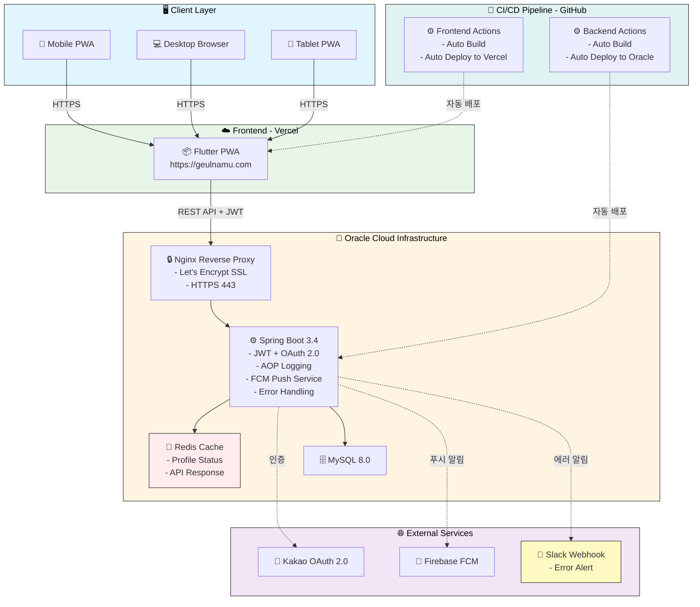
```mermaid
graph TB
    subgraph Client["🖥️ Client Layer"]
        A[📱 Mobile PWA]
        B[💻 Desktop Browser]
        C[📱 Tablet PWA]
    end

    subgraph CICD["🤖 CI/CD Pipeline - GitHub"]
        D1["⚙️ Frontend Actions
- Auto Build
- Auto Deploy to Vercel"]
        D2["⚙️ Backend Actions
- Auto Build
- Auto Deploy to Oracle"]
    end

    subgraph Frontend["☁️ Frontend - Vercel"]
        D["📦 Flutter PWA
https://geulnamu.com"]
    end

    subgraph Oracle["🏢 Oracle Cloud Infrastructure"]
        E["🔒 Nginx Reverse Proxy
- Let's Encrypt SSL
- HTTPS 443"]
        F["⚙️ Spring Boot 3.4
- JWT + OAuth 2.0
- AOP Logging
- FCM Push Service
- Error Handling"]
        G["🚀 Redis Cache
- Profile Status
- API Response"]
        H[🗄️ MySQL 8.0]
    end

    %% ✅ External을 Oracle 아래로 이동
    subgraph External["🌐 External Services"]
        I[🔑 Kakao OAuth 2.0]
        J[🔔 Firebase FCM]
        K["📢 Slack Webhook
- Error Alert"]
    end

    A & B & C -->|HTTPS| D
    D -->|REST API + JWT| E
    E --> F
    F --> G
    F --> H

    H ~~~ External

    D1 -.->|자동 배포| D
    D2 -.->|자동 배포| F

    F -.->|인증| I
    F -.->|푸시 알림| J
    F -.->|에러 알림| K

    style Client fill:#e1f5ff,stroke:#333,color:#000
    style CICD fill:#e0f2f1,stroke:#333,color:#000
    style Frontend fill:#e8f5e9,stroke:#333,color:#000
    style Oracle fill:#fff4e1,stroke:#333,color:#000
    style External fill:#f3e5f5,stroke:#333,color:#000
    style G fill:#ffebee,stroke:#333
    style K fill:#fff9c4,stroke:#333
```

### Backend 아키텍쳐 특징

- **계층형 아키텍처**: Controller → Service → Repository → Domain
- **CQRS 패턴**: Command/Query Repository 분리
- **DDD 스타일**: 비즈니스 로직을 Entity에 캡슐화
- **AOP 활용**: `@LogAction` 어노테이션으로 횡단 관심사 처리
- **보안**: JWT + OAuth 2.0 (Kakao)기반의 RBAC 설계
- **배포 환경**: GitHub Actions를 활용한 배포 자동화

## 기술 스택

### Backend

- Spring Boot 3.4 / JAVA 17 / Spring Data JPA / QueryDSL / MySQL / OAuth 2.0 / JWT / FCM

### Frontend

- Flutter PWA (반응형) / GoRouter / AI-assisted(Claude)

### Infrastructure

- Oracle Cloud(Ubuntu) / Vercel / Nginx / Let’s Encrypt / Github Actions

## 기술적 챌린지

### 어노테이션 기반 AOP 로깅 시스템

- 문제
  - 장애 발생 시, 분석을 위한 로그 필요
- 해결법
  - Spring AOP + 커스텀 어노테이션(`@LogAction`, `@ErrorLogAction`) 활용
  - 비동기 처리(`@Async`)로 메인 로직 성능 영향 최소화
  - GET 요청은 에러만, POST/PATCH/DELETE는 전체 로깅하여 DB 부하 조절
- 결과
  - 비동기 처리로 메인 로직 성능 영향 최소화
  - 로그 서버 비용 0$ (DB 저장)

### Redis 캐싱을 통한 성능 최적화

- 문제
  - 모임 목록/상세 조회 API가 전체 요청의 많은 비중을 차지
  - 변경 빈도가 낮은 데이터를 반복 조회하여 DB 부하 발생
- 해결법
  - Spring Cache + Redis 연동하여 자주 조회되는 API에 캐싱 적용
  - TTL 5분 설정으로 데이터 신선도와 캐시 효율 균형 유지
  - 수정/삭제 시 Cache Evict 전략을 사용해 DB와 캐시간 정합성 유지
- 결과
  - API 응답 속도 50% 개선 (100ms → 50ms)
  - 서버 부하 감소로 안정적인 서비스 제공

### GitHub Actions CI/CD 자동 배포 파이프라인

- 문제
  - 수동 배포 시, 빌드, 업로드, 재시작 등 반복 작업으로 시간 소요 및 실수 가능성 존재
  - 배포 작업 중 다른 개발 작업에 집중 불가
- 해결법
  - GitHub Actions로 main 브랜치 push시 자동 빌드 및 배포
  - Backend: Gradle 빌드 → Oracle Cloud 배포 (3분)
  - Frontend: Flutter 빌드 → Vervel 배포 (2분)
- 결과
  - 배포 완전 자동화로 개발 집중력 향상
  - 휴먼 에러 제거 및 배포 안정성 향상

## CI/CD 파이프라인

- **GitHub Actions + Oracle Cloud/Vercel**
- 메인 브랜치 push 시 자동 빌드 및 배포
- 빌드 시간: 3분 (Backend) / 2분 (Frontend)
- 배포 URL
  - Frontend: https://geulnamu.com
  - Backend: https://api.geulnamu.com

## 주요 테이블 관계도(ERD)

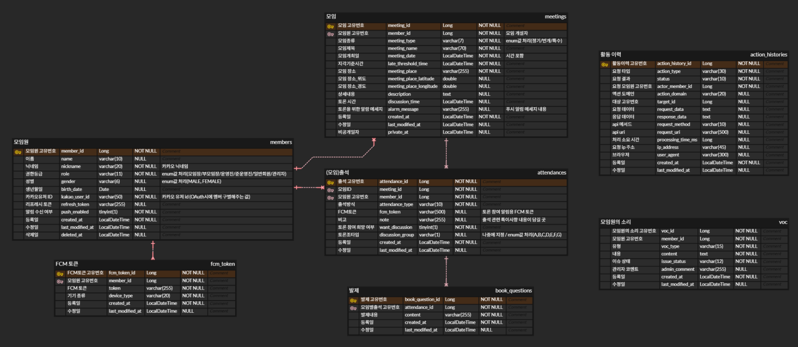

[링크](https://www.erdcloud.com/d/mgGNCamYYs28DYphr)

## 주요 기능

- 카카오 로그인: 소셜 로그인 기반 회원 인증 (JWT + OAuth 2.0 + 6단계 역할 RBAC)
- 모임 관리: 정기/번개/특수 모임 생성, 일정·장소 설정, 시간 기반 수정 제한
- QR 코드 출석: 모임별 고유 QR 생성/스캔, 실시간 출석 처리, 현황 페이지에서 모임원별 출석 현황 확인
- 토론 그룹 관리: 토론 참여 의사 선택, 참여 희망자 대상으로 조 편성, 토론 그룹 드래그 앤 드롭 관리
- 발제문 시스템: 그룹별 토론 주제 작성/조회, 시간 기반 수정 제한
- 회원 관리: 6단계 역할 기반 권한(MEMBER~ADMIN), 회원 활성화/비활성화
- 문의하기: 에러 보고/기능 요청 작성, 이슈 상태 관리 (관리자)
- 푸시 알림: FCM 기반 타겟팅 알림, 모임 공지, 개인별 수신 설정

## 개발 방식 및 특이사항

### AI 협업 기반 풀스택 개발

- **백엔드**: Spring Boot 3.4 기반 직접 설계 및 구현
  - CQRS 패턴, QueryDSL, Redis 캐싱 등 기술 활용
- **프론트엔드**: Claude AI와 협업하여 Flutter 구현
  - 디자인 시스템 가이드라인 작성 → AI 활용 개발
  - 일관된 UI/UX 유지 및 빠른 프로토타이핑
  - PWA 네비게이션 패턴 등 복잡한 문제 해결
- **배운 점**
  - 명확한 가이드라인 작성의 중요성
  - AI를 도구로 활용한 개발 생산성 향상

## 주요 화면 구성

### 인증 및 계정

<table>
  <tr>
    <td style="text-align:center"></td>
    <td style="text-align:center">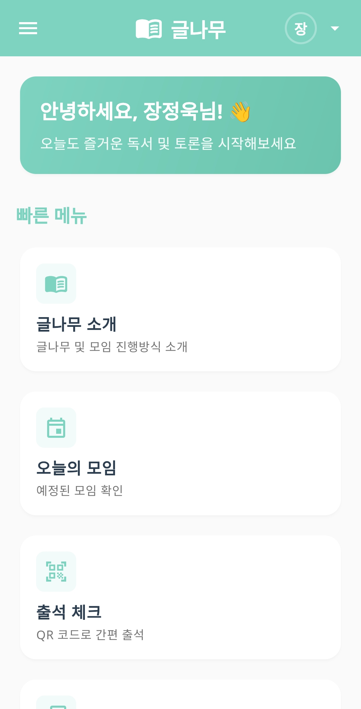</td>
    <td style="text-align:center">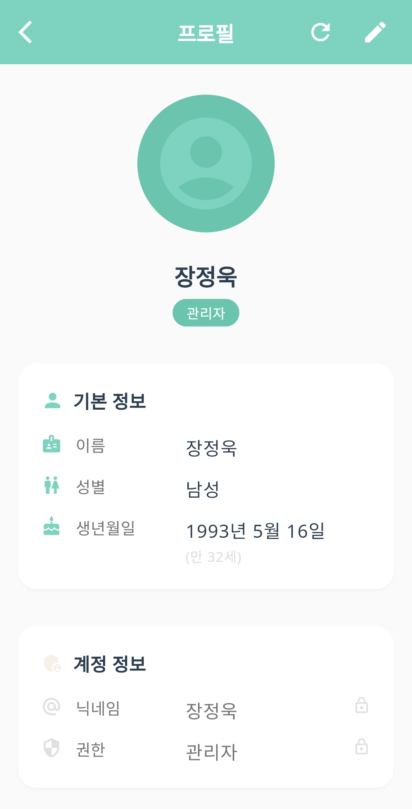</td>
  </tr>
  <tr style="text-align:center">
    <td>로그인</td><td>홈 화면</td><td>프로필 관리</td>
  </tr>
</table>

### 모임 관리

<table>
  <tr>
    <td style="text-align:center">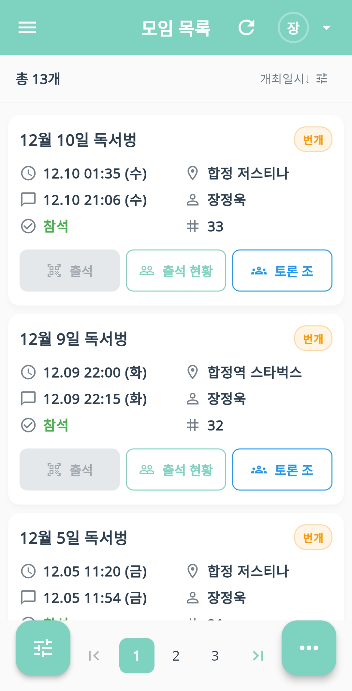</td>
    <td style="text-align:center">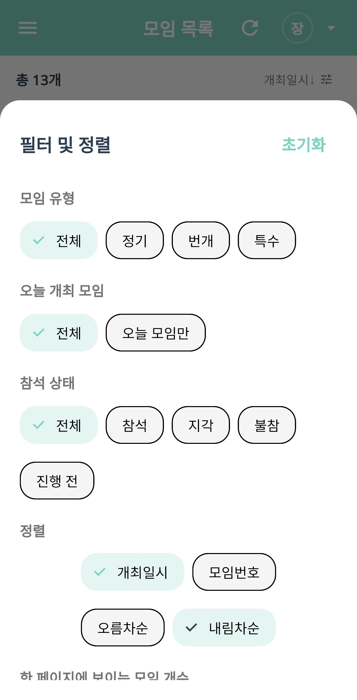</td>
    <td style="text-align:center">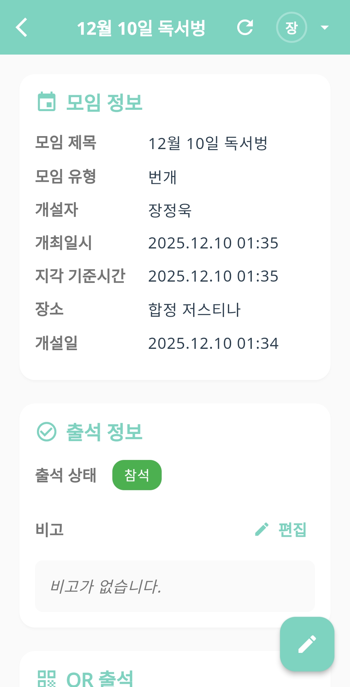</td>
    <td style="text-align:center">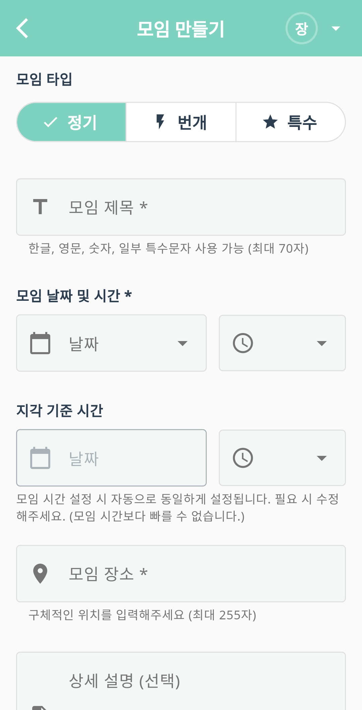</td>
    <td style="text-align:center">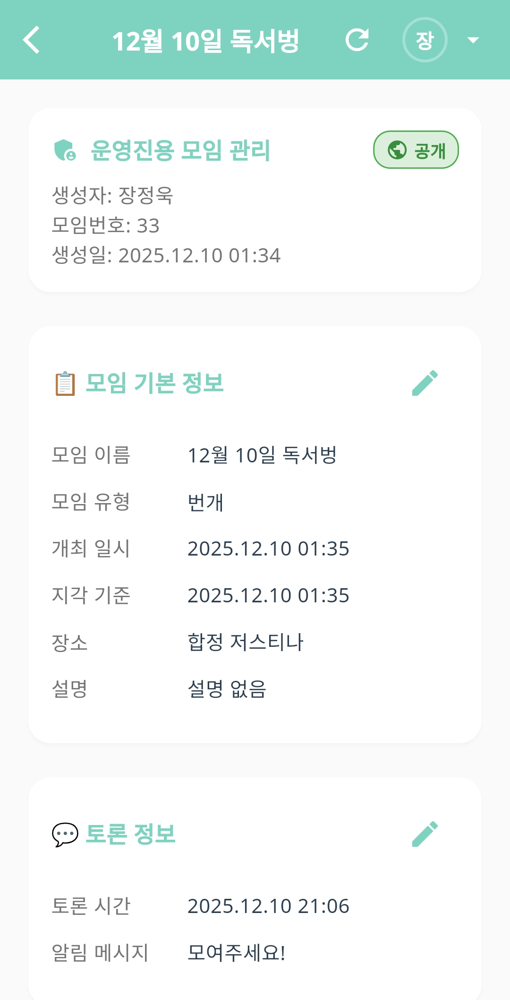</td>
  </tr>
  <tr style="text-align:center">
    <td>모임 목록</td><td>모임 목록 (필터)</td><td>모임 상세</td><td>모임 생성 (운영진용)</td><td>모임 상세 (운영진용)</td>
  </tr>
</table>

### 출석 관리

<table>
  <tr>
    <td style="text-align:center">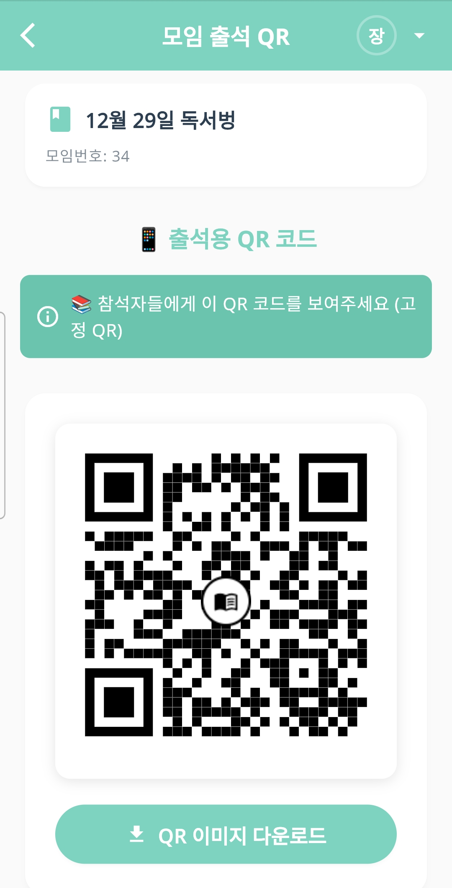</td>
    <td style="text-align:center">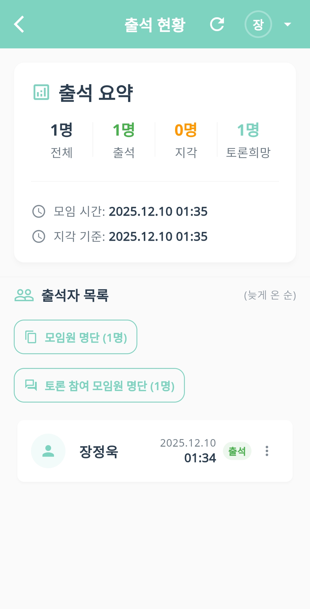</td>
  </tr>
  <tr style="text-align:center">
    <td>QR 출석</td><td>출석 현황</td>
  </tr>
</table>

### 토론 및 발제

<table>
  <tr>
    <td style="text-align:center">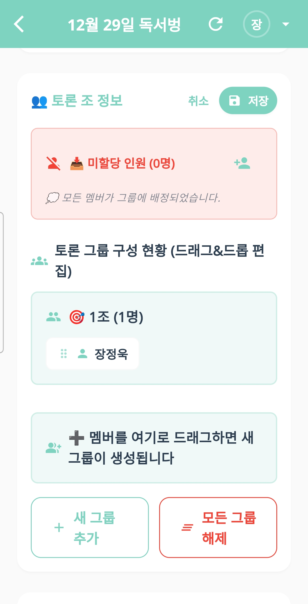</td>
    <td style="text-align:center">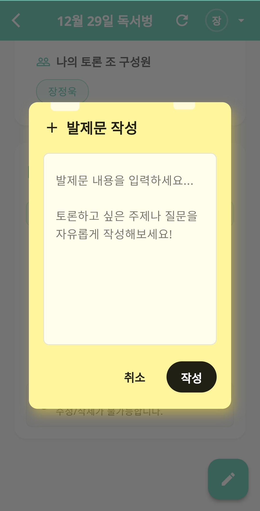</td>
  </tr>
  <tr style="text-align:center">
    <td>토론그룹 편성</td><td>발제문 작성</td>
  </tr>
</table>

### 회원 관리 (관리자)

<table>
  <tr>
    <td style="text-align:center">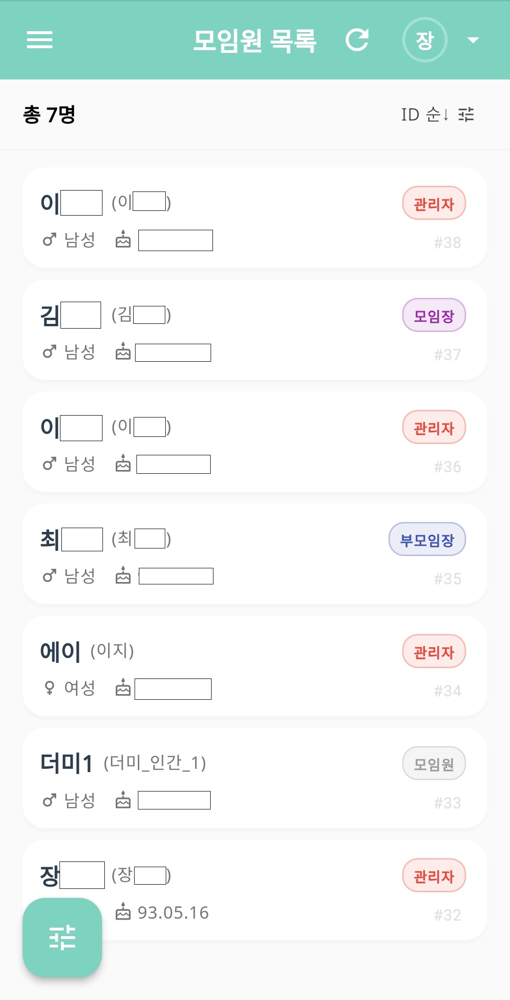</td>
    <td style="text-align:center">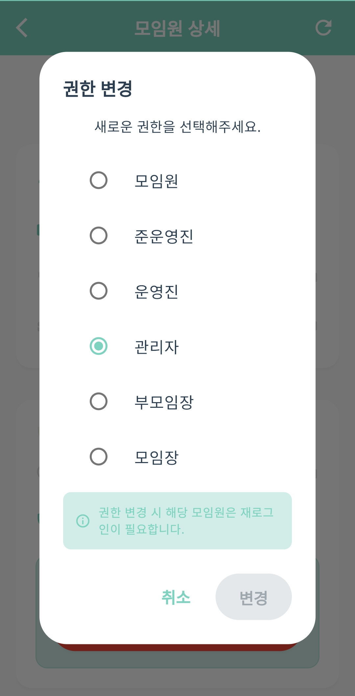</td>
  </tr>
  <tr style="text-align:center">
    <td>회원 관리</td><td>권한 관리</td>
  </tr>
</table>

### 운영 및 모니터링 (관리자)

<table>
  <tr>
    <td style="text-align:center">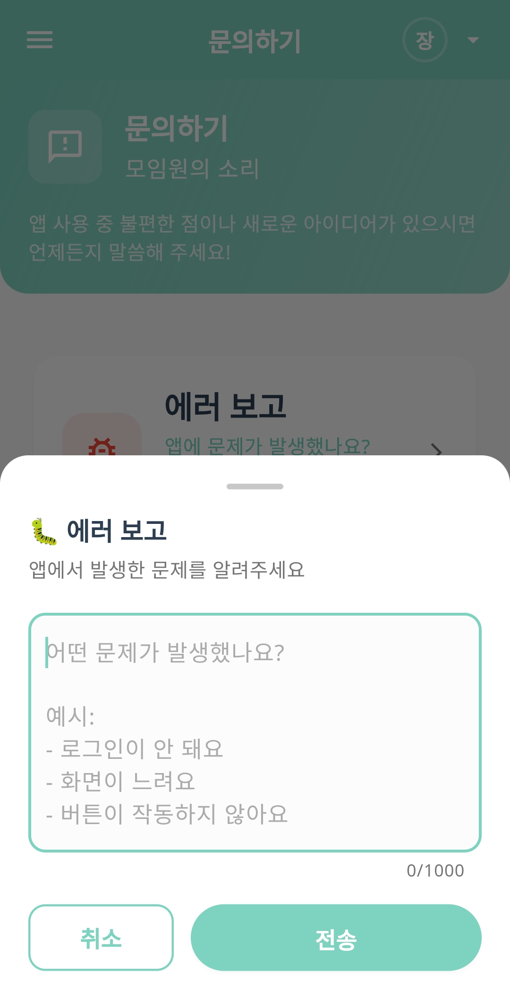</td>
    <td style="text-align:center">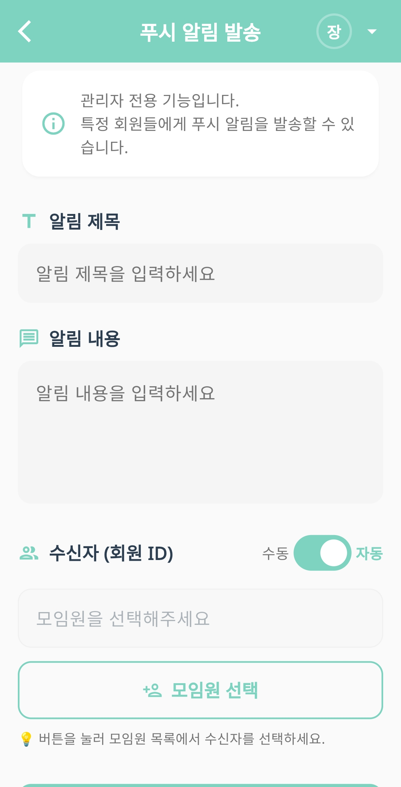</td>
  </tr>
  <tr style="text-align:center">
    <td>문의하기</td><td>푸시 알림</td>
  </tr>
</table>

### UI/UX

<table>
  <tr>
    <td style="text-align:center">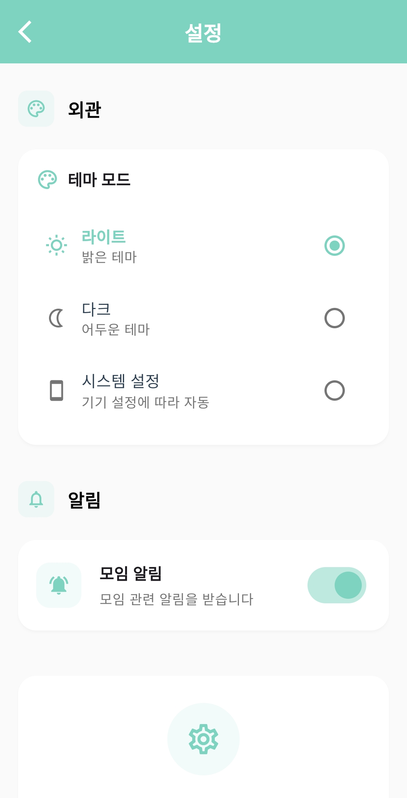</td>
    <td style="text-align:center">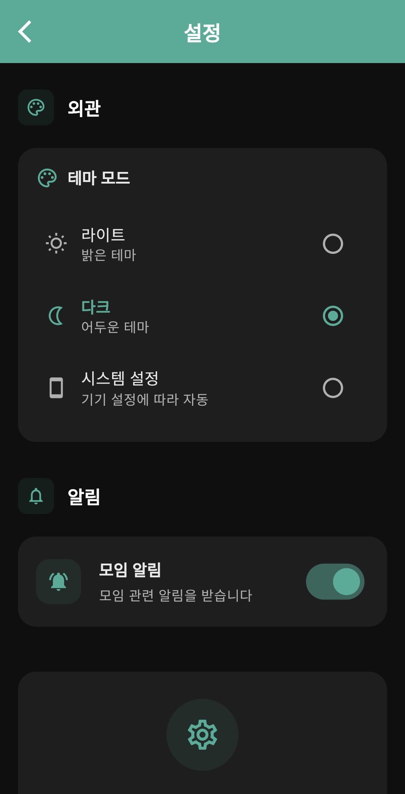</td>
    <td style="text-align:center">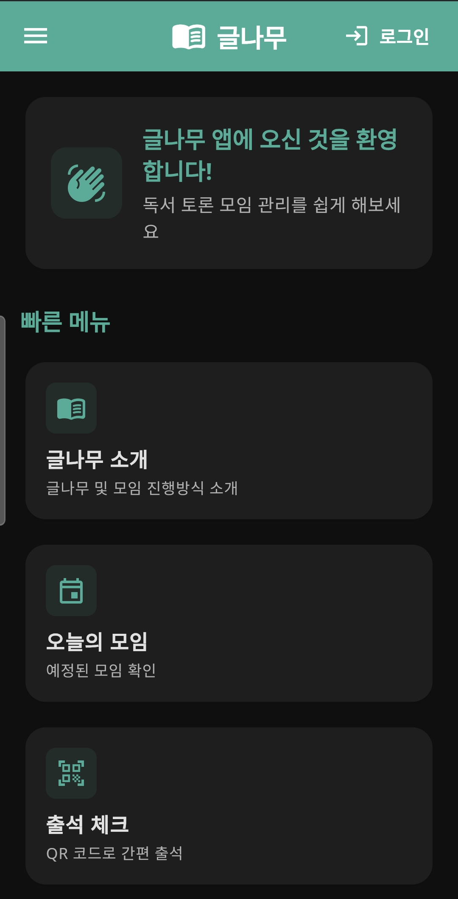</td>
    <td style="text-align:center">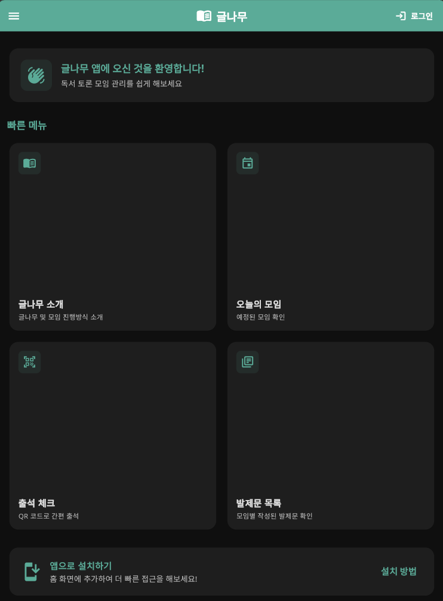</td>
  </tr>
  <tr style="text-align:center">
    <td>라이트 모드</td><td>다크 모드</td><td>반응형 화면 (모바일 뷰)</td><td>반응형 화면(데스크톱 뷰)</td>
  </tr>
</table>

## 향후 계획

- 기능 관련: 향후, 위치 기반 출석 체크 기능 추가 예정
- 서비스 관련: 기기별 대응 작업 완료 후, 모임과 논의를 거쳐 서비스 예정
